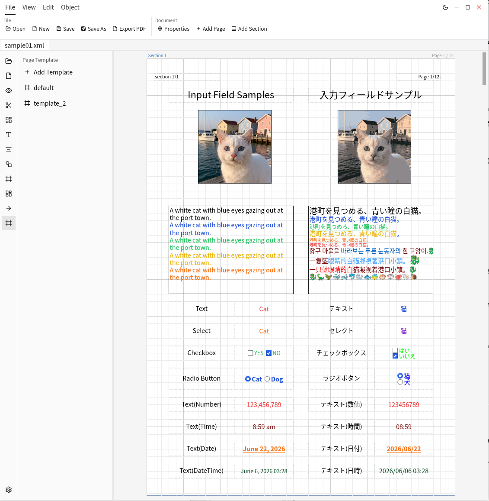

# hogandoc

**日本語** | [English](#english)

図形編集ソフトウェア **hogandoc** の配布リポジトリです。Windows / macOS / Linux 向けのビルド済みバイナリを GitHub Release で公開しています。

> ℹ️ hogandoc の機能・特徴の説明はここに追記してください（このリポジトリには配布物のみが置かれています）。

## スクリーンショット



## ダウンロード

最新版は以下から入手できます（常に最新リリースを指します）。

| OS | ダウンロード |
|----|-------------|
| Windows (x86_64) | [インストーラ (.msi)](https://github.com/TomoyukiNakama/hogandoc/releases/latest/download/hogandoc-windows-x86_64.msi) / [zip](https://github.com/TomoyukiNakama/hogandoc/releases/latest/download/hogandoc-windows-x86_64.zip) |
| macOS (Apple Silicon) | [.dmg](https://github.com/TomoyukiNakama/hogandoc/releases/latest/download/hogandoc-macos-arm64.dmg) |
| Linux (x86_64) | [.AppImage](https://github.com/TomoyukiNakama/hogandoc/releases/latest/download/hogandoc-linux-x86_64.AppImage) |

過去のバージョンは [Releases ページ](https://github.com/TomoyukiNakama/hogandoc/releases) を参照してください。

## インストール手順

### Windows
- `.msi` をダブルクリックしてインストーラを実行する。または `.zip` を展開して実行ファイルを直接起動する。

### macOS (Apple Silicon)
- `.dmg` をマウントし、アプリを「アプリケーション」フォルダにドラッグする。
- 初回起動時に Gatekeeper の警告が出る場合は、右クリック →「開く」で起動する。

### Linux
- `.AppImage` に実行権限を付与して起動する：
  ```bash
  chmod +x hogandoc-linux-x86_64.AppImage
  ./hogandoc-linux-x86_64.AppImage
  ```

## ライセンス

本ソフトウェアはプロプライエタリ（独自ライセンス）です。詳細は [LICENSE](LICENSE) を参照してください。
Copyright (c) 2026 Tomoyuki Nakama. All rights reserved.

---

## English

This is the distribution repository for **hogandoc**, a shape/diagram editing application. Prebuilt binaries for Windows / macOS / Linux are published as GitHub Releases.

> ℹ️ Add a description of hogandoc's features here. This repository contains distribution artifacts only.

### Screenshot


### Download

Always points to the latest release:

| OS | Download |
|----|----------|
| Windows (x86_64) | [Installer (.msi)](https://github.com/TomoyukiNakama/hogandoc/releases/latest/download/hogandoc-windows-x86_64.msi) / [zip](https://github.com/TomoyukiNakama/hogandoc/releases/latest/download/hogandoc-windows-x86_64.zip) |
| macOS (Apple Silicon) | [.dmg](https://github.com/TomoyukiNakama/hogandoc/releases/latest/download/hogandoc-macos-arm64.dmg) |
| Linux (x86_64) | [.AppImage](https://github.com/TomoyukiNakama/hogandoc/releases/latest/download/hogandoc-linux-x86_64.AppImage) |

See the [Releases page](https://github.com/TomoyukiNakama/hogandoc/releases) for previous versions.

### Installation

- **Windows**: Run the `.msi` installer, or extract the `.zip` and launch the executable directly.
- **macOS (Apple Silicon)**: Open the `.dmg` and drag the app into Applications. On first launch, if Gatekeeper blocks it, right-click → Open.
- **Linux**: Make the AppImage executable and run it:
  ```bash
  chmod +x hogandoc-linux-x86_64.AppImage
  ./hogandoc-linux-x86_64.AppImage
  ```

### License

This software is proprietary. See [LICENSE](LICENSE) for details.
Copyright (c) 2026 Tomoyuki Nakama. All rights reserved.
